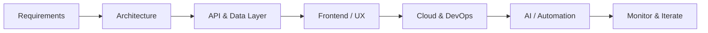

<div align="center">

<!-- ═══════════════════════════════════════════════════════════════════════════ -->
<!-- HERO -->
<!-- ═══════════════════════════════════════════════════════════════════════════ -->


<br/>


<br/><br/>

[](https://github.com/Abhithecoder-22)
[](https://github.com/Abhithecoder-22?tab=followers)
[](https://github.com/Abhithecoder-22?tab=stars)

<br/>

### Full Stack & AWS Engineer · AI Systems · Event-Driven Architecture

**5+ years** shipping production web apps, multi-tenant SaaS, and AI-powered platforms across healthcare, education, and enterprise workflows.

<br/>

[](https://abhi-portfolio-ashen.vercel.app/)
[](https://www.linkedin.com/in/abhijeet-singh-88a3ba220/)
[](mailto:abhijeet02022002@gmail.com)

<br/>


</div>

---

## Professional Summary

I design and deliver **end-to-end software systems** — from React/Next.js frontends and Node/Django backends to **AWS-hosted**, **Dockerized** microservices with **Kafka**, **Redis**, and async job pipelines. I specialize in **AI orchestration** (RAG, MCP, OpenAI/Mistral), **multi-tenant SaaS**, and platforms that need **RBAC**, **real-time workflows**, and **operational scale**.

> Focused on clean architecture, measurable reliability, and products that hold up under real user load.

<br/>

<details>
<summary><b>📌 Quick navigation</b></summary>

| Section | Jump |
|:--------|:-----|
| About | [About Me](#about-me) |
| Services | [Services I Offer](#services-i-offer) |
| Stack | [Tech Stack](#tech-stack) |
| AI | [AI & Architecture](#ai--architecture-expertise) |
| Focus | [Engineering Focus](#engineering-focus) |
| Projects | [Featured Projects](#featured-projects) |
| Stats | [GitHub Analytics](#github-analytics) |
| Contact | [Connect](#connect-with-me) |

</details>

---

## About Me

```typescript
const abhijeet = {
  name: "Abhijeet Singh",
  role: "Full Stack & AWS Engineer",
  experience: "5+ years",
  location: "India",
  focus: [
    "Scalable SaaS & multi-tenant systems",
    "Event-driven & microservice architectures",
    "AI orchestration — RAG, MCP, workflow automation",
    "Production DevOps — Docker, AWS, CI-ready deployments",
  ],
  currentlyBuilding: [
    "AI-powered SaaS platforms",
    "Healthcare & telemedicine workflows",
    "Enterprise ERP & operational systems",
  ],
  principles: ["Ship fast, architect right", "Observability over guesswork", "Security by default"],
  services: ["Web & mobile development", "AWS architecture", "AI automation", "SaaS & microservices"],
  portfolio: "https://abhi-portfolio-ashen.vercel.app/",
  github: "https://github.com/Abhithecoder-22",
  email: "abhijeet02022002@gmail.com",
  askMeAbout: ["System design", "RAG pipelines", "NestJS/Next.js stacks", "Kafka & async jobs"],
  funFact: "I turn complex business workflows into maintainable, testable code paths.",
};

export default abhijeet;
```

---

## Tech Stack

<div align="center">

### Core


<br/>

### Data & Cloud


<br/>

### Also working with


</div>

<br/>

<details>
<summary><b>🛠 Stack breakdown by layer</b></summary>

| Layer | Technologies |
|:------|:-------------|
| **Frontend** | React.js, Next.js, TypeScript, Redux, Tailwind CSS, JavaScript |
| **Backend** | Node.js, Express.js, Django, NestJS, GraphQL, Python |
| **Databases** | MongoDB, PostgreSQL, MySQL, Redis, Prisma, Supabase |
| **Cloud & DevOps** | Docker, AWS, Nginx, Linux, Firebase |
| **Messaging** | Apache Kafka, Redis Streams, BullMQ, event-driven pipelines |
| **Architecture** | Microservices, async processing, API gateways, multi-tenant SaaS |

</details>

---

## Services I Offer

<div align="center">

**Available for freelance, contract, and long-term engineering engagements.**

</div>

| Service | What I deliver | Typical stack |
|:--------|:---------------|:--------------|
| **Web Development** | Production-ready SPAs, dashboards, admin panels, and marketing sites with performance-first UX | React, Next.js, TypeScript, Redux, Tailwind |
| **Mobile & Cross-Platform** | Responsive web apps, PWA-ready experiences, and mobile-optimized product flows integrated with your backend | React, Next.js, REST/GraphQL APIs, Firebase |
| **Backend & APIs** | Secure REST/GraphQL services, auth layers, business logic, and third-party integrations | Node.js, NestJS, Express, Django, Python |
| **AWS & Cloud Architecture** | Scalable cloud design — compute, storage, networking, and cost-aware deployments | AWS (EC2, S3, Transcribe), Docker, Nginx, Linux |
| **AI & Intelligent Systems** | RAG pipelines, LLM integrations, speech-to-text, workflow automation, and AI SaaS features | OpenAI, Mistral, MCP, async workers |
| **DevOps & Infrastructure** | Containerization, CI-ready setups, caching, queues, and production hardening | Docker, Redis, Kafka, BullMQ, Nginx |
| **System Architecture** | Multi-tenant SaaS, microservices, event-driven design, API gateways, and RBAC platforms | Kafka, Redis Streams, Prisma, PostgreSQL |

<br/>

<details>
<summary><b>💼 Engagement types</b></summary>

| Type | Best for |
|:-----|:---------|
| **MVP → Production** | Startups validating product-market fit with a solid technical foundation |
| **Scale-up & refactor** | Existing apps needing performance, structure, or cloud migration |
| **AI feature integration** | Products adding transcription, summarization, RAG, or agent workflows |
| **Dedicated engineering** | Teams needing a full-stack + AWS engineer on sprint-based delivery |

**Let's discuss your project →** [abhijeet02022002@gmail.com](mailto:abhijeet02022002@gmail.com) · [Portfolio](https://abhi-portfolio-ashen.vercel.app/)

</details>

---

## AI & Architecture Expertise

| Domain | Capabilities | Production context |
|:-------|:-------------|:-------------------|
| **RAG & retrieval** | Chunking, embedding pipelines, context injection | Meeting intelligence, document Q&A |
| **MCP & orchestration** | Model Context Protocol tooling, agent workflows | AI SaaS, developer automation |
| **LLM integrations** | OpenAI, Mistral — prompts, tools, fallbacks | Telemedicine, interviews, parsing |
| **Speech & meetings** | STT pipelines, transcription, summarization | MeetHive, healthcare notes |
| **Workflow automation** | Resume parsing, interview systems, async jobs | HR tech, operational platforms |
| **Event-driven systems** | Kafka, Redis Streams, BullMQ workers | SaaS scale, booking, ERP |
| **Multi-tenant SaaS** | Auth, caching, gateways, Dockerized services | Centralized identity, tenant isolation |
| **Platform engineering** | RBAC, analytics, org management, observability | ERP, LMS, marketplace apps |

---

## Engineering Focus

<div align="center">

| Pillar | Description |
|:-------|:------------|
| **Reliability** | Fault-tolerant APIs, queue-backed async work, and caching strategies that reduce load under peak traffic |
| **Security** | RBAC, tenant isolation, secure auth flows, and healthcare-grade data handling where required |
| **Scalability** | Horizontal-ready services, stateless backends, and cloud-native patterns on AWS |
| **Developer experience** | Typed codebases (TypeScript), clear module boundaries, and maintainable service contracts |
| **AI in production** | Practical LLM usage — not demos — with observability, fallbacks, and cost-aware design |

</div>

<br/>

<details>
<summary><b>⚙️ How I approach builds</b></summary>



1. **Discovery** — Map roles, workflows, and non-functional needs (scale, compliance, latency).
2. **Architecture** — Choose monolith vs microservices, sync vs async, and data boundaries early.
3. **Build** — Iterative delivery with testable APIs and component-driven frontends.
4. **Deploy** — Dockerized services, AWS resources, Redis/Kafka where throughput demands it.
5. **Enhance** — Analytics, AI features, and performance tuning based on real usage.

</details>

---

## Featured Projects

End-to-end products I've architected and built — spanning **enterprise ops**, **SaaS**, **healthcare AI**, and **marketplace scale**.

<div align="center">

<table>
<tr>
<td width="50%" valign="top">

### ERP System

[](https://github.com/Abhithecoder-22)

**Unified operations platform** for schools and organizations — replacing fragmented spreadsheets with a single source of truth for attendance, scheduling, and admin workflows.

Built a **two-level RBAC** model so super-admins, org admins, and staff each see only what they need. **QR-based attendance** cuts manual entry; **AI timetable generation** reduces planning overhead. Role-specific dashboards surface analytics for leadership without cluttering day-to-day screens.

| Capability | Detail |
|:-----------|:-------|
| Security | Two-level **RBAC**, org-scoped data |
| Operations | **QR attendance**, org & branch management |
| AI | **AI timetable generation** from constraints |
| UX | Admin, teacher & student dashboards + analytics |

`React` `Node.js` `PostgreSQL` `Redis` `RBAC` `AI APIs`

</td>
<td width="50%" valign="top">

### Multi-Tenant SaaS

[](https://demo.smartcloudschool.com/)[](https://demo.smartcloudschool.com/)

**Cloud-native SaaS backbone** designed for multiple customers on shared infrastructure without data leakage — the pattern behind scalable B2B products.

Services run in **Docker** with a central **API gateway**, **centralized auth**, and **Redis** for session/cache hot paths. Heavy work (emails, reports, webhooks) flows through **async workers** so API latency stays predictable under load.

| Capability | Detail |
|:-----------|:-------|
| Infra | **Microservices**, API gateway, Docker |
| Auth | Centralized identity across tenants |
| Performance | **Redis** caching & rate-friendly reads |
| Processing | Queue-backed async pipelines |

`Docker` `NestJS` `Redis` `Kafka` `PostgreSQL` `API Gateway`

</td>
</tr>
<tr>
<td width="50%" valign="top">

### Academun — LMS Platform

[](https://academun.com/) [](https://academun.com/)

**Institution-grade LMS** connecting learning delivery with day-to-day operations — not just course pages, but the workflows schools actually run on.

Students and instructors get dedicated dashboards; admins manage courses, cohorts, and permissions through **role-based access**. The frontend is fully responsive; the backend is structured for growing institutions and automated operational tasks.

| Capability | Detail |
|:-----------|:-------|
| Core | Course lifecycle, content & enrollment flows |
| Users | Student & instructor portals |
| Access | Granular **RBAC** per role |
| Ops | Workflow automation for institutional tasks |

`Next.js` `React` `Node.js` `PostgreSQL` `RBAC`

</td>
<td width="50%" valign="top">

### Bahja — Booking Platform

[](https://www.staging.bahja.co/) [](https://www.staging.bahja.co/)

**Service marketplace & booking engine** for high-volume scheduling — vendors, customers, and payments coordinated in one platform.

Handles **dynamic availability**, vendor onboarding, and booking state machines at scale. Frontend and backend stay in sync for real-time slot updates, operational dashboards, and payment-adjacent flows without breaking user trust.

| Capability | Detail |
|:-----------|:-------|
| Domain | End-to-end booking & service discovery |
| Architecture | Marketplace + vendor tenancy patterns |
| Systems | Scheduling, calendars, vendor CRM-style tools |
| Flows | Payments, notifications, operational admin |

`React` `Node.js` `MongoDB` `Redis` `WebSockets`

</td>
</tr>
<tr>
<td width="50%" valign="top">

### ChatRx — AI Telemedicine

[](https://www.chatrx.md/) [](https://www.chatrx.md/)

**AI-augmented telemedicine** where automation supports clinicians — not replaces them — through secure, real-time patient interactions.

Patients get guided intake and AI-assisted flows; physicians retain oversight on consultations. Architecture prioritizes **secure patient records**, **real-time messaging**, and infrastructure that can grow with healthcare compliance needs.

| Capability | Detail |
|:-----------|:-------|
| AI | Assisted intake & consultation support |
| Clinical | Physician-in-the-loop workflows |
| Data | Encrypted, role-scoped patient records |
| Realtime | Low-latency chat & session handling |

`Next.js` `Node.js` `OpenAI` `WebSockets` `PostgreSQL`

</td>
<td width="50%" valign="top">

### MeetHive — AI Meetings

[](https://github.com/Abhithecoder-22)

**Meeting intelligence platform** that turns conversations into searchable knowledge — record, transcribe, summarize, and retrieve context per organization.

**Speech-to-text** feeds **RAG pipelines** for accurate summaries and Q&A over past meetings. **Mistral & OpenAI** power generation layers; org-level admin controls who sees what. Built for teams that live in meetings but need outcomes, not just recordings.

| Capability | Detail |
|:-----------|:-------|
| AI | **STT**, summaries, RAG over meeting corpuses |
| Models | **Mistral** & **OpenAI** with fallback paths |
| Ops | Multi-org admin & member management |
| Pipeline | Upload → transcribe → embed → query |

`React` `Django` `AWS Transcribe` `S3` `RAG` `Mistral` `OpenAI`

</td>
</tr>
</table>

</div>

<br/>

<details>
<summary><b>🚀 More builds on my portfolio</b></summary>

Explore additional work — ride-hailing, social platforms, transcription SaaS, and e-commerce — on my [**portfolio**](https://abhi-portfolio-ashen.vercel.app/).

| Project | Highlight |
|:--------|:----------|
| **Drivo** | Real-time ride tracking with WebSockets & maps |
| **K.I.M.** | Enterprise STT & synthesis with AWS Transcribe |
| **Twaddle** | Social feed platform with GraphQL & Prisma |
| **Burger Wala** | Food ordering with Razorpay payments |

</details>

---

## GitHub Analytics

<div align="center">


<br/>

### Stats


<br/>

### Streak


<br/>

### Trophies


<br/>

### Contribution Graph

[](https://github.com/Abhithecoder-22)


</div>

---

## Connect With Me

<div align="center">

I'm open to **full-time roles**, **freelance contracts**, and **technical collaborations** — web & mobile products, **AWS architecture**, AI platforms, and high-scale backends.

[](mailto:abhijeet02022002@gmail.com)

<br/>

[](https://github.com/Abhithecoder-22)
[](https://www.linkedin.com/in/abhijeet-singh-88a3ba220/)
[](https://abhi-portfolio-ashen.vercel.app/)
[](mailto:abhijeet02022002@gmail.com)

</div>

---

<div align="center">


<br/><br/>


**Abhijeet Singh** · Full Stack & AWS Engineer · AI Systems Builder

<sub>Built with focus — designed for production.</sub>

</div>
